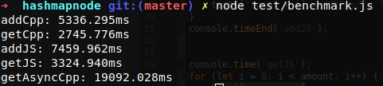

# Native Hashmap  
  
Simple but fast Hashmap for NodeJS. Implemented in C++.

## Install
due to the implementation in C++, a C++-Compiler is required and on certain OS libuv and libboost.
on Debian/Ubuntu install the c++ boost library with following command:
```
sudo apt-get install libboost-all-dev
```
On Archlinux you can do:
```
sudo pacman -Syu boost
```
And then:

```
npm i nativehashmap
```
## Sample Usage

```javascript
var hashmap=require("nativehashmap");
hashmap.add("key", "value");
console.log(hashmap.get("key"));
```

Its possible to store JSON objects like:

```javascript
addon.add("object", JSON.stringify({o:"test"}));
console.log(JSON.parse(addon.get("object")).o === "test");
```

Also you can fetch values Async

```javascript
addon.add("object", JSON.stringify({o:"test"}));
addon.getAsync("object",function(value){
   console.log(JSON.parse(value).o === "test"); 
});
```

Check out the Tests and Benchmarks for further examples

## Metrics

Compared to npm package "hashmap" this implementation is about twice as fast in reading and writing.
Even compared to default Javascript Array access "native hashmap" is a magnitude faster in synchronously reading and writing.
Benchmark for yourself by executing

```
npm run benchmark
```
Latest benchmark results for writing and reading 5000k strings consecutively:


